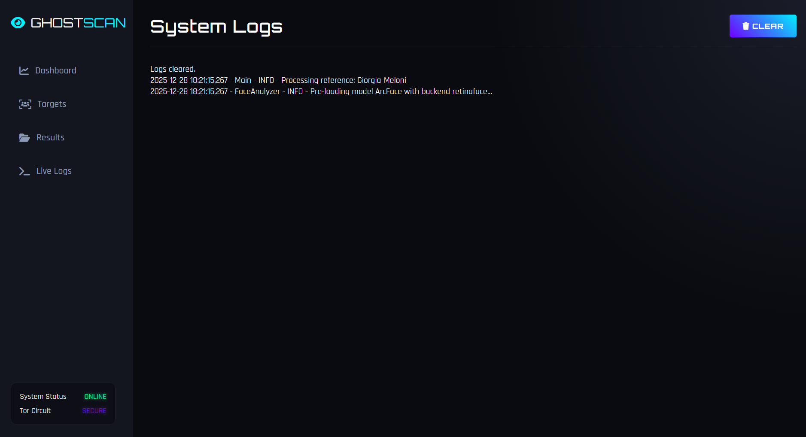

# GhostScan 👻

**GhostScan** is an advanced, AI-powered OSINT (Open Source Intelligence) tool designed for facial recognition and deep web scanning. 

<p align="center">
  
  
  
</p>

## 🚀 Features

*   **Smarter Search**: Algorithms that generate intelligent query variations across multiple search engines and social platforms (LinkedIn, Instagram, etc.).
*   **DeepFace Integration**: Utilizes state-of-the-art models (ArcFace, RetinaFace) for high-accuracy facial verification.
*   **Tor & Privacy**: All traffic is routed through a rotating Tor proxy to ensure anonymity and bypass IP blocks.
*   **Parallel Processing**: High-performance multi-threaded downloading and analysis.
*   **Web Interface**: Premium dark-mode dashboard for managing targets and viewing results in real-time.

## 🛠️ Installation

### Prerequisites
*   Docker & Docker Compose
*   NVIDIA GPU (Recommended for faster inference)

### Setup

1.  Clone the repository:
    ```bash
    git clone https://github.com/yourusername/ghostscan.git
    cd ghostscan
    ```

2.  Build and Run:
    ```bash
    docker-compose up --build -d
    ```

3.  Access the Web UI:
    Open [http://localhost:8000](http://localhost:8000) in your browser.

## 📖 Usage

1.  **Add Target**: Drag & drop a clear reference photo of the person you want to find into the Web UI.
2.  **Scan**: Click "INITIATE SCAN". GhostScan will:
    *   Generate advanced dork queries.
    *   Scrape images via Tor.
    *   Filter results using metadata.
    *   Verify faces using DeepFace.
3.  **Results**: View verified matches and confidence scores in the "Results" tab.

## 🛡️ License

This project is for educational and research purposes only. Use responsible and adhere to all local laws and regulations regarding privacy and OSINT.
